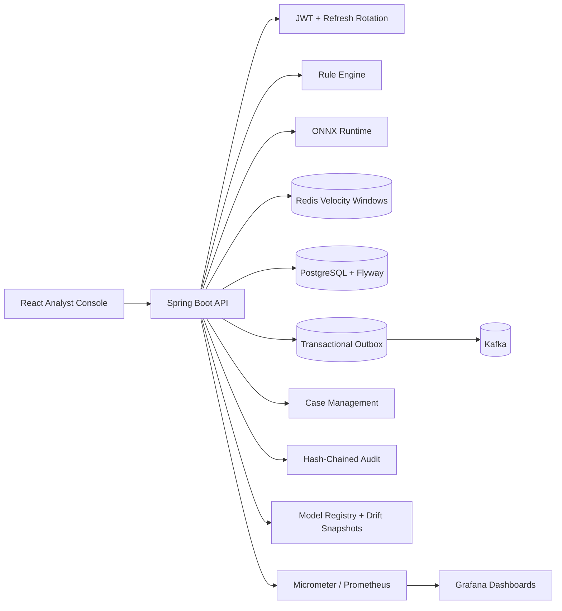
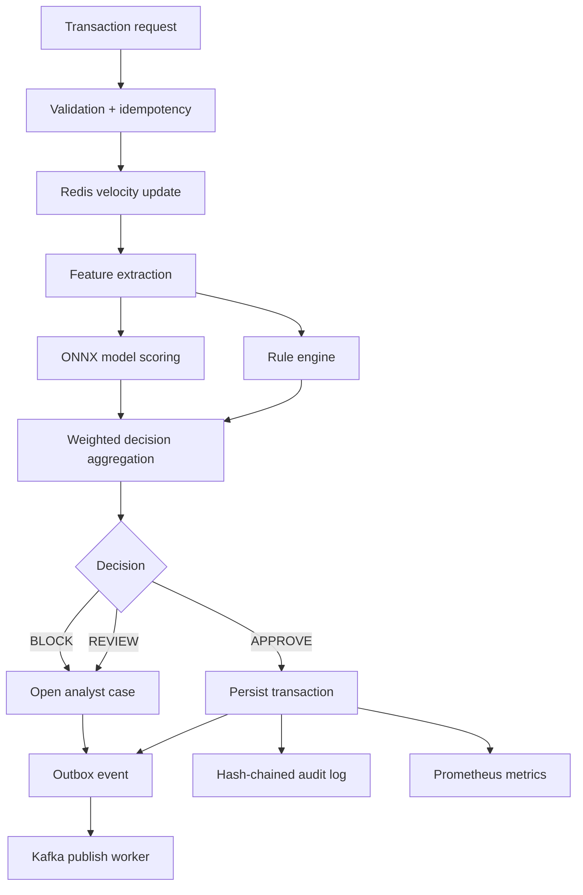

# IntelliGuard

**AI-powered real-time fraud detection platform for financial transactions.**

IntelliGuard combines deterministic fraud rules, Redis velocity features, ONNX model inference, tenant-scoped authorization, analyst case management, transactional event publishing, tamper-evident audit logs, model governance, and operational observability.

The project is built as a production-oriented **modular monolith**: one runnable codebase, clear domain boundaries, and realistic extraction points for auth, fraud decisions, case management, audit, model serving, and analytics.

## Contents

- [Problem](#problem)
- [What IntelliGuard Does](#what-intelliguard-does)
- [Architecture](#architecture)
- [Implemented Capabilities](#implemented-capabilities)
- [Tech Stack](#tech-stack)
- [Quick Start](#quick-start)
- [Verification](#verification)
- [API Overview](#api-overview)
- [Observability](#observability)
- [Project Structure](#project-structure)
- [Production Tradeoffs](#production-tradeoffs)
- [Interview Discussion Points](#interview-discussion-points)
- [Roadmap](#roadmap)

## Problem

Banks and fintech companies lose significant money to payment fraud. Simple rule-based systems are brittle: they block too many legitimate users, miss coordinated attacks, and are hard to adapt as fraud patterns change.

IntelliGuard addresses this by combining multiple detection layers:

- deterministic rules for high-confidence policy checks;
- Redis-backed velocity windows for behavioral anomalies;
- in-process ONNX model scoring;
- tenant-scoped security boundaries;
- analyst case management for suspicious transactions;
- audit and observability systems that support investigation and operations.

The goal is not just to return a fraud score. The goal is to model the surrounding production system a financial company would need to operate, investigate, audit, and monitor fraud decisions.

## What IntelliGuard Does

For each submitted transaction, IntelliGuard:

1. Validates the request and applies idempotency protection.
2. Records velocity features in Redis.
3. Evaluates deterministic fraud rules.
4. Runs ONNX model inference when the model is available.
5. Combines rule and ML signals into `APPROVE`, `REVIEW`, or `BLOCK`.
6. Persists the decision in PostgreSQL.
7. Emits Kafka events through a transactional outbox.
8. Creates an analyst case for `REVIEW` and `BLOCK` decisions.
9. Writes a tamper-evident audit record.
10. Records business and model metrics for Prometheus/Grafana.

## Architecture



### Decision Flow



More detail:

- [Production Architecture](docs/PRODUCTION_ARCHITECTURE.md)
- [Security Threat Model](docs/SECURITY_THREAT_MODEL.md)
- [Observability](docs/OBSERVABILITY.md)
- [Demo Script](docs/DEMO_SCRIPT.md)

## Implemented Capabilities

### Fraud Detection Engine

- Transaction submission with optional `Idempotency-Key`.
- Rule engine using Spring-discovered `FraudRule` strategies.
- Fraud rules:
  - country blocklist;
  - amount threshold;
  - amount spike;
  - night-time activity;
  - Redis velocity;
  - unknown device.
- Redis sorted-set rolling windows for transaction velocity and amount velocity.
- Feature engine for ONNX input generation.
- ONNX Runtime integration for in-process model inference.
- Weighted rule + ML decisioning into `APPROVE`, `REVIEW`, or `BLOCK`.
- Explanation endpoint with feature values and feature-importance-style contributions.

### Security And Access Control

- Spring Security with stateless JWT access tokens.
- JWT issuer, audience, role, tenant, and token ID claims.
- Refresh-token rotation with hashed storage.
- Refresh-token family revocation for replay/reuse detection.
- BCrypt password hashing.
- RBAC for analyst, manager, and admin workflows.
- Tenant-scoped transaction, audit, case, and idempotency access.
- Trusted-proxy-aware API and login rate limiting.
- Configurable CORS.
- Security headers.
- Restricted health-detail defaults.
- Secrets externalized through environment variables.

### Reliability And Data Integrity

- PostgreSQL persistence.
- Flyway-owned schema.
- Hibernate validation instead of auto-mutating production schema.
- Database check constraints for critical enum/range fields.
- Tenant-scoped indexes.
- Optimistic locking on mutable aggregates.
- Transactional outbox for Kafka publishing.
- Multi-worker-safe outbox claiming using `FOR UPDATE SKIP LOCKED`.
- Retry backoff and terminal failure state for outbox events.

### Analyst Operations

- Automatic case creation for `REVIEW` and `BLOCK` decisions.
- Case queue with status filters.
- Case assignment.
- Investigation notes.
- Resolution workflow for confirmed fraud and false positives.
- Resolved cases are protected from further mutation.

### Audit And Compliance

- Immutable-style audit records for fraud decisions.
- Audit records include decision, score, model version, timing, actor, and reason.
- Hash chain using `previousHash` and `recordHash` to detect tampering.
- Tenant-scoped audit lookup by transaction and sender.

### Model Governance

- Model registry table.
- Champion model registration at startup.
- Inference metrics for:
  - model version;
  - transaction;
  - latency;
  - fraud probability;
  - fallback status;
  - error message.
- Drift snapshots for:
  - sample count;
  - average score;
  - fallback rate;
  - high-risk score rate;
  - `OK`, `WATCH`, `ALERT`, or `INSUFFICIENT_DATA` state.

### Observability

- Request trace ID propagation through `X-Trace-Id`.
- SLF4J MDC trace correlation.
- Spring Actuator and Micrometer Prometheus endpoint.
- Custom business metrics:
  - `intelliguard_fraud_decisions_total`;
  - `intelliguard_fraud_decision_latency_seconds`;
  - `intelliguard_outbox_pending`;
  - `intelliguard_cases_open`;
  - `intelliguard_model_fallbacks_15m`.
- Prometheus alert rules.
- Grafana datasource and dashboard provisioning.

### Frontend

- React/Vite analyst console.
- Login page.
- Dashboard.
- Transaction list.
- Case-management page.
- Audit page.
- Protected routes.
- Accessible labels for login fields.
- Keyboard-accessible sidebar navigation.
- Playwright smoke tests.

### CI And Testing

- GitHub Actions for backend tests and packaging.
- Frontend build and Playwright smoke tests.
- Docker image builds for backend and frontend.
- CodeQL analysis.
- Dependency review on pull requests.
- Unit tests for rule engine, transaction flow, refresh-token rotation, outbox behavior, case workflow, audit hash chain, and model governance.
- Testcontainers integration-test harness for Docker-backed infrastructure tests.

## Tech Stack

| Layer | Technology | Purpose |
| --- | --- | --- |
| Backend | Java 17, Spring Boot 3.2 | REST APIs, dependency injection, application runtime |
| Security | Spring Security, JWT, BCrypt | Authentication, authorization, password hashing |
| Database | PostgreSQL 16, Spring Data JPA, Flyway | Transactions, users, cases, audit, model governance |
| Cache | Redis 7.2 | Velocity checks and rolling windows |
| Eventing | Apache Kafka | Transaction and fraud alert events |
| Reliability | Transactional outbox | Atomic event persistence and async publish |
| ML Runtime | ONNX Runtime | In-process model inference |
| Observability | Actuator, Micrometer, Prometheus, Grafana | Metrics, dashboards, alerts |
| Frontend | React, Vite, Axios | Analyst console |
| Testing | JUnit 5, Mockito, Testcontainers, Playwright | Unit, integration harness, frontend smoke tests |
| Packaging | Docker, Docker Compose | Local full-stack runtime |
| CI | GitHub Actions, CodeQL, dependency review | Build, test, scan |

## Quick Start

### Prerequisites

- Java 17+
- Maven 3.9+
- Docker Desktop
- Node.js 20+

### Run The Full Stack

1. Create a local environment file.

```bash
cp .env.example .env
```

2. Replace placeholder secrets in `.env`.

3. Start the stack.

```bash
docker-compose up --build
```

Services:

| Service | URL |
| --- | --- |
| Frontend | http://localhost:3000 |
| Backend | http://localhost:8080 |
| Swagger | http://localhost:8080/swagger-ui.html |
| Prometheus | http://localhost:9090 |
| Grafana | http://localhost:3001 |
| Health | http://localhost:8080/api/health/status |

Demo data is disabled by default. To seed local demo users and transactions:

```env
DEMO_SEED_DATA=true
```

Seeded users are for local demos only:

| Role | Username | Password |
| --- | --- | --- |
| Admin | `admin` | `password123` |
| Analyst | `analyst` | `analyst123` |
| Manager | `manager` | `manager123` |

## Verification

Backend unit tests:

```bash
mvn test -B
```

Frontend build:

```bash
cd frontend
npm run build
```

Frontend smoke tests:

```bash
cd frontend
npx playwright install chromium
npm run test:e2e
```

Docker-backed integration profile:

```bash
mvn verify -Pintegration-tests
```

## API Overview

Swagger UI is available at:

```text
http://localhost:8080/swagger-ui.html
```

### Authentication

```http
POST /api/auth/login
POST /api/auth/refresh
POST /api/auth/logout
```

Login returns an access token and refresh token. Refresh tokens are rotated and stored as hashes.

### Transactions

```http
POST /api/transactions
GET /api/transactions?status=BLOCK&page=0&size=20
GET /api/transactions/{id}
GET /api/transactions/{id}/explain
```

Example request:

```json
{
  "senderId": "USER_001",
  "receiverId": "USER_002",
  "amount": 98000.00,
  "currency": "INR",
  "country": "NG",
  "paymentMethod": "NET_BANKING",
  "deviceType": "UNKNOWN",
  "ipAddress": "197.210.84.21"
}
```

### Case Management

```http
GET /api/cases
GET /api/cases/{id}
PATCH /api/cases/{id}/assign
POST /api/cases/{id}/notes
PATCH /api/cases/{id}/resolve
```

Suspicious transactions automatically create cases for analyst review.

### Audit

```http
GET /api/audit
GET /api/audit/transaction/{transactionId}
GET /api/audit/sender/{senderId}
```

Audit records include `previousHash` and `recordHash` for tamper-evident verification.

### Model Governance

```http
GET /api/models
POST /api/models/drift-snapshots
GET /api/models/drift-snapshots
```

## Observability

Provisioned monitoring includes:

- Prometheus scrape config: [prometheus.yml](prometheus.yml)
- Prometheus rules: [prometheus-rules.yml](prometheus-rules.yml)
- Grafana datasource provisioning: [grafana/provisioning/datasources/prometheus.yml](grafana/provisioning/datasources/prometheus.yml)
- Grafana dashboard provisioning: [grafana/provisioning/dashboards/dashboards.yml](grafana/provisioning/dashboards/dashboards.yml)
- Grafana overview dashboard: [grafana/dashboards/intelliguard-overview.json](grafana/dashboards/intelliguard-overview.json)

Dashboards cover:

- HTTP request rate;
- HTTP 5xx rate;
- p95 latency;
- JVM heap usage;
- HikariCP connection pool usage;
- Kafka producer send rate;
- fraud decisions by outcome;
- fraud decision p95 latency.

Alerts cover:

- backend down;
- high 5xx rate;
- high p95 HTTP latency;
- DB pool saturation;
- outbox backlog;
- open case backlog;
- model fallback spike;
- fraud decision latency;
- block-rate spike.

## Project Structure

```text
intelliguard/
|-- src/main/java/com/intelliguard/
|   |-- config/          # Security, Redis, Kafka, OpenAPI, tracing, observability
|   |-- controller/      # REST API endpoints
|   |-- dto/             # Request/response contracts
|   |-- engine/          # Rule engine and fraud rules
|   |-- entity/          # JPA entities
|   |-- exception/       # Error handling
|   |-- Kafka/           # Kafka producer/consumer handlers
|   |-- repository/      # Spring Data repositories
|   `-- service/         # Application/domain services
|-- src/main/resources/
|   |-- db/migration/    # Flyway schema
|   `-- ML/model.onnx    # ONNX fraud model artifact
|-- src/test/java/       # Unit tests and Testcontainers harness
|-- frontend/            # React analyst console and Playwright tests
|-- grafana/             # Grafana provisioning and dashboards
|-- docs/                # Architecture, threat model, observability, demo script
|-- docker-compose.yml
|-- prometheus.yml
|-- prometheus-rules.yml
`-- .github/workflows/
```

## Production Tradeoffs

Implemented deliberately:

- Modular monolith instead of premature microservices.
- Synchronous decision path so payment authorization receives an immediate decision.
- Outbox instead of direct Kafka publish inside the request transaction.
- Tenant-scoped data access in service/repository methods.
- Hash-chained audit as a practical tamper-evidence baseline.
- Feature-importance-style explanations rather than claiming a full SHAP pipeline.

Not claimed as implemented:

- Drools rule DSL;
- Neo4j fraud-ring graph detection;
- Elasticsearch/OpenSearch transaction search;
- Cassandra storage;
- Jaeger distributed tracing;
- gRPC ingestion;
- WebSocket/SSE live alerts;
- production SHAP pipeline;
- Kubernetes/Helm/Terraform deployment;
- published load-test results.

These are documented as possible extensions rather than presented as completed features.

## Interview Discussion Points

- Why a modular monolith is the right current boundary.
- Where auth, model serving, audit, and case management would split into services.
- How tenant isolation prevents IDOR.
- How refresh-token rotation limits session theft blast radius.
- How trusted-proxy-aware rate limiting avoids spoofed `X-Forwarded-For`.
- How `FOR UPDATE SKIP LOCKED` makes the outbox multi-worker safe.
- What guarantees the outbox does and does not provide.
- Why fraud decisioning remains synchronous.
- How Redis velocity windows behave under hot senders.
- How audit hash chaining detects tampering.
- How model drift snapshots are computed.
- How business metrics differ from generic JVM metrics.
- What would break first at 1,000 TPS.

## Roadmap

High-impact future work:

- OAuth2/OIDC integration with an external identity provider.
- WORM or external immutable audit sink.
- Full SHAP explainability pipeline.
- Automated retraining pipeline and offline validation reports.
- Case SLA timers and escalation policy.
- OpenSearch analytics for large-scale investigation queries.
- Optional graph service for fraud-ring detection.
- Load-test report with p95/p99 latency and throughput numbers.
- Kubernetes/Helm/Terraform deployment path.
- Docker Compose smoke test in CI.
