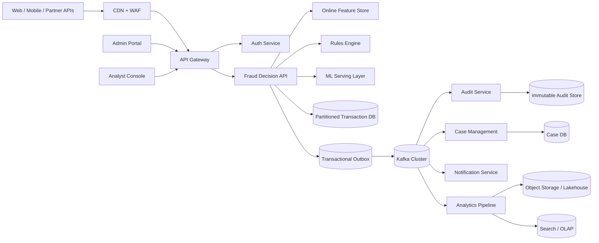
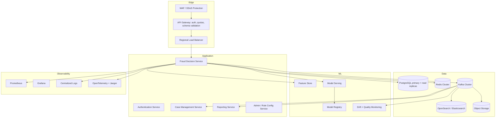
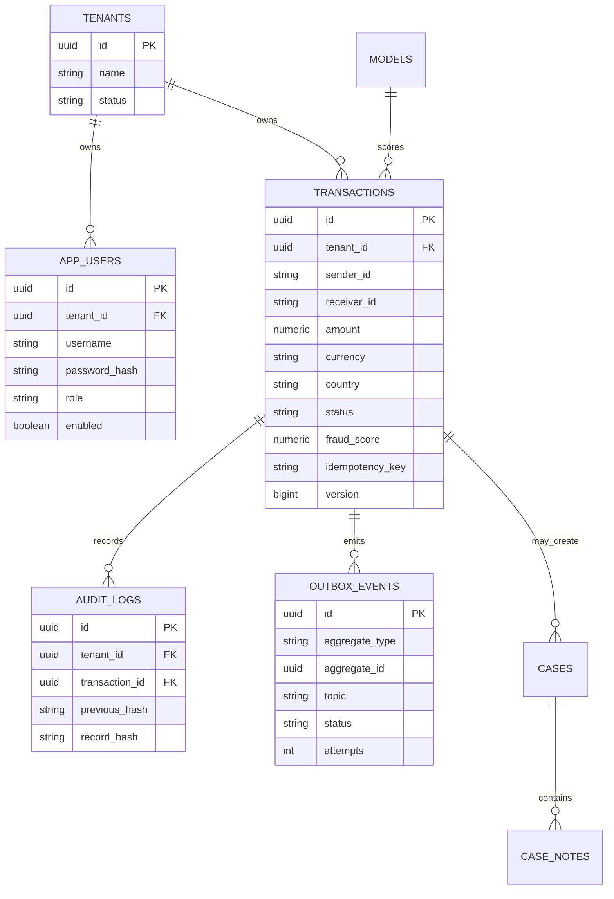

# IntelliGuard Production Architecture

This document defines the target architecture for evolving IntelliGuard from a portfolio MVP into a production financial fraud detection platform. The current repository remains a modular monolith because it is the right size for a single-developer codebase, but the boundaries below are the intended extraction points when traffic, team ownership, or regulatory requirements justify service decomposition.

## Target Scale

- 100 million users
- 10 million transactions/day
- 1,000 sustained TPS with burst headroom
- 99.99% availability
- Multi-region active/passive first, active/active after data residency is solved
- Banking-grade auditability, least privilege, tenant isolation, and incident response

## System Context

## Runtime Architecture

## Current Findings And Ownership Plan

| Issue | Problem | Danger | Top-company solution | Files to change | Priority |
| --- | --- | --- | --- | --- | --- |
| Hardcoded secrets | Compose contained database, JWT, and Grafana secrets | Repo leak enables token forgery or environment takeover | Secret manager, required env vars, rotation | `docker-compose.yml`, `.env.example`, future Kubernetes secrets | P0 - implemented baseline |
| Demo seeding by default | Default users/passwords were created on startup | Production exposure creates known accounts | Explicit demo profile/property only | `DataSeeder.java`, `application.properties` | P0 - implemented |
| Spoofable rate limit identity | `X-Forwarded-For` was trusted from any caller | Attackers bypass login/API throttles | Trust forwarded headers only from known proxies | `RateLimitFilter.java` | P0 - implemented |
| JWT lifecycle incomplete | Access tokens had no refresh rotation or revocation | Stolen tokens remain valid until expiry | OAuth2/OIDC, refresh-token family rotation, revocation table | `AuthController`, `JwtUtil`, `RefreshTokenService`, `RefreshToken` | P0 - rotation implemented, OAuth2 pending |
| IDOR risk | Roles authorize broad transaction access, not ownership/tenant scope | Cross-tenant data exposure | Tenant-aware authorization and ABAC policies | controllers, services, schema | P0 - tenant scoping implemented, full ABAC pending |
| Kafka trusted packages wildcard | JSON deserializer accepted all packages | Increases deserialization attack surface | Allow only project DTO package | `application.properties` | P1 |
| Native resource cleanup | ONNX tensors/results closed only on success | Native memory leaks under inference failures | try-with-resources | `MLScoringService.java` | P1 |
| Public health details | Health details were exposed by default | Reveals internals to attackers | Details only when authorized | `application.properties`, actuator security | P1 |
| SQL logging default | SQL logged by default | PII leakage and noisy production logs | Off by default, structured redacted logs | `application.properties` | P1 |
| Weak integration tests | Tests mock infrastructure | False confidence | Testcontainers for Postgres, Redis, Kafka | `src/test`, CI | P1 - Testcontainers harness added |
| Frontend page parsing bug | Transactions page expects array, API returns page wrapper | Broken UI under real API | Typed API client and data adapters | `frontend/src/api`, pages | P1 |
| Missing case workflow | Fraud decisions stopped at scoring, with no analyst operations | REVIEW/BLOCK decisions cannot be investigated or resolved | Case queue, assignment, notes, resolution, SLA tracking | `FraudCaseService`, `CaseController`, `CasesPage` | P1 - core workflow implemented |
| Audit mutability limits | Audit table is append-only by convention, not cryptographically tamper-evident | Insider changes may be undetected | Hash-chain audit records, WORM/external sink | schema, audit service | P2 - hash chain implemented, WORM sink pending |
| Outbox multi-worker safety | Poller has no explicit skip-locked claim | Duplicate publishing under multiple instances | Claim rows with `FOR UPDATE SKIP LOCKED` and idempotent consumers | repository/service/schema | P2 - row claiming implemented, idempotent consumers pending |
| Velocity hot-key cost | Redis amount window sums all entries in Java | Hot users create O(n) request latency | Atomic counters/buckets or stream aggregation | `VelocityService` | P2 |
| No model governance | ONNX exists but registry/drift/retraining are missing | Silent model degradation | model registry, champion/challenger, drift metrics | ML services/schema/pipeline | P2 - registry, inference metrics, drift snapshots implemented; retraining pending |
| Shallow CI | CI only tested Maven backend | Frontend, Docker, and security regressions slip through | Split backend/frontend/Docker/scanning jobs | `.github/workflows/ci.yml` | P1 - implemented |
| Weak traceability | Logs could not be correlated by request | Incidents require manual log stitching | Trace IDs, MDC, propagated response headers, OTel | `TraceIdFilter`, observability docs | P1 - trace ID baseline implemented |

## Security Target State

- OAuth2/OIDC for workforce login, short-lived access tokens, refresh-token rotation for first-party sessions.
- JWT claims: issuer, audience, subject, tenant, role, permissions, token id, issued-at, expiration, key id.
- Key rotation with JWKS and overlapping validity windows.
- Revocation by token id and refresh-token family id.
- RBAC for coarse access and ABAC for tenant, account, region, case assignment, and data sensitivity.
- Tenant isolation at every query boundary, backed by schema constraints and authorization tests.
- Rate limiting by trusted client IP, user, tenant, endpoint, and risk tier.
- Security headers, strict CORS, HSTS at the edge, TLS everywhere.
- Secrets from a secrets manager, never from committed defaults.
- Dependency scanning, SAST, container scanning, DAST, and a maintained threat model.

## Database Target State

Required database upgrades:

- Add `tenant_id` to user, transaction, audit, outbox, and case tables.
- Add check constraints for status, role, fraud score, amount, currency length, and timestamps.
- Add foreign keys where retention policy allows it.
- Partition transactions and audit logs by month and optionally hash subpartition by tenant.
- Add optimistic locking with `version` on mutable aggregates.
- Add idempotency uniqueness on `(tenant_id, idempotency_key)`.
- Add retention jobs for hot/warm/cold storage.

## Testing Targets

- Unit coverage: 80%+ for domain/application logic.
- Integration coverage: Postgres, Redis, Kafka, Flyway, Spring Security, outbox publishing.
- Contract tests: public API schemas and Kafka event schemas.
- Security tests: IDOR, role boundaries, token expiry, revocation, rate limit spoofing.
- Performance tests: k6/Gatling baseline at 1,000 TPS with p95/p99 targets.
- Frontend tests: Playwright smoke flows, accessibility checks, table/filter/case workflows.
- Mutation testing for fraud-rule logic.

## Implementation Roadmap

| Phase | Days | Difficulty | Scope | Risk | Resume impact |
| --- | ---: | --- | --- | --- | --- |
| 1. Security baseline | 2-4 | Medium | secrets, demo seeding, headers, proxy trust, deserializer allowlist, SQL/health defaults | Low | Removes immediate rejection signals |
| 2. Auth hardening | 5-8 | High | refresh rotation, revocation, issuer/audience/kid, auth tests | Medium | Enables serious security discussion |
| 3. Tenant isolation | 6-10 | High | tenant schema, ABAC service, IDOR tests, frontend tenant context | High | Moves from demo to enterprise SaaS posture |
| 4. Integration proof | 4-7 | Medium | Testcontainers for Postgres/Redis/Kafka, CI expansion | Medium | Proves system works outside mocks |
| 5. Outbox and eventing | 4-6 | Medium | row claiming, idempotent consumers, DLQ metrics | Medium | Shows reliability engineering |
| 6. Case management | 8-12 | High | cases, assignments, notes, SLA, analyst UI | Medium | Adds real business workflow |
| 7. Observability | 4-6 | Medium | structured logs, OTel, dashboards, alerts, SLOs | Low | Shows production ownership |
| 8. ML governance | 10-15 | High | model registry, champion/challenger, drift metrics, SHAP pipeline | High | Makes fraud/ML claims credible |
| 9. Scale data path | 8-12 | High | partitioning, query plans, search/analytics, retention | High | Supports senior architecture discussion |
| 10. Deployment maturity | 8-12 | High | Helm, probes, autoscaling, canary/rollback docs | Medium | Rounds out production readiness |

## Interview Value

After these upgrades, strong interview topics include:

- Why a modular monolith first, and where service boundaries emerge.
- How tenant isolation is enforced in schema, service, and tests.
- Why outbox is used and what guarantees it provides.
- How idempotency works under concurrency.
- How fraud latency budgets influence synchronous vs asynchronous design.
- How model drift is detected and mitigated.
- How token rotation and revocation limit blast radius.
- How audit hash chaining detects tampering.
- How p95/p99 latency and error budgets guide scaling decisions.
