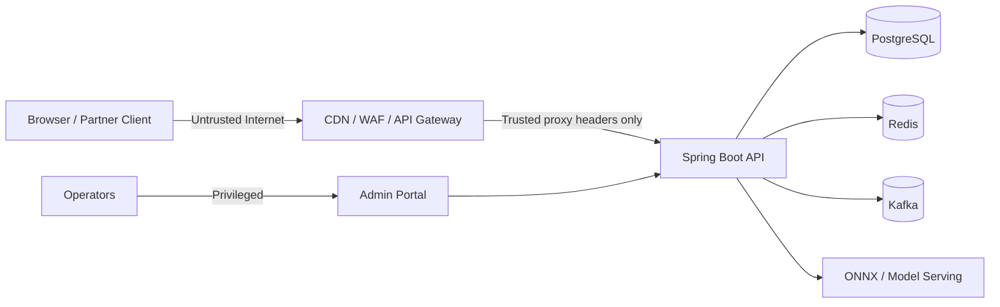

# IntelliGuard Security Threat Model

## Assets

- Transaction records and fraud decisions
- Customer and tenant identifiers
- Analyst/admin accounts
- JWT signing keys and refresh tokens
- Audit logs
- Fraud rules, model artifacts, and feature data
- Kafka events and operational metrics

## Trust Boundaries

## Primary Threats

| Threat | Attack | Impact | Control |
| --- | --- | --- | --- |
| Token theft | XSS or local device compromise steals bearer token | Account takeover until token expiry | Short-lived access tokens, refresh rotation, revocation, CSP, frontend XSS testing |
| Token forgery | Leaked signing secret used to mint JWTs | Full API compromise | Secrets manager, key rotation, JWKS, no committed secrets |
| IDOR | Analyst accesses transaction/case from another tenant | Banking data breach | Tenant-scoped authorization checks and query filters |
| Rate-limit bypass | Caller spoofs `X-Forwarded-For` | Credential stuffing and API abuse | Trust forwarded headers only from configured proxies |
| Deserialization abuse | Kafka consumer trusts arbitrary classes | Remote code or unsafe object creation risk | Package allowlist and schema-based events |
| Audit tampering | Insider modifies fraud decision history | Regulatory and legal exposure | Append-only records, hash chain, external immutable sink |
| Model manipulation | Attacker sends crafted traffic to exploit weak rules/model | Fraud loss or false positives | Adversarial tests, drift monitoring, rule/model versioning |
| Secret leakage | Compose/CI logs expose passwords or keys | Environment compromise | Secret scanning and masked CI variables |
| Dependency compromise | Vulnerable library or container image | RCE/data exposure | Dependabot, SCA, container scanning, pinned images |
| Excessive health data | Public endpoints expose infrastructure state | Reconnaissance | Authorized health details and minimal public liveness |

## Required Security Tests

- Login throttling cannot be bypassed with spoofed `X-Forwarded-For`.
- Expired, malformed, wrong-audience, wrong-issuer, revoked, and wrong-key JWTs are rejected.
- Users cannot read transactions, audit logs, or cases outside their tenant.
- Manager/admin-only endpoints reject analyst tokens.
- Public registration cannot create privileged accounts.
- Security headers are present on API responses.
- Kafka consumers reject non-IntelliGuard event packages/schemas.
- Dependency and container scans run in CI.

## Penetration Test Checklist

- OWASP API Top 10 authorization and authentication testing
- JWT algorithm/key confusion tests
- Brute-force and credential-stuffing simulation
- CORS misconfiguration testing
- Tenant boundary testing
- Injection testing for search/filter endpoints
- Business-logic abuse for idempotency and duplicate transactions
- Replay attacks against transaction submission
- Audit-log tampering simulation
- Denial-of-service tests against hot senders and expensive query paths

